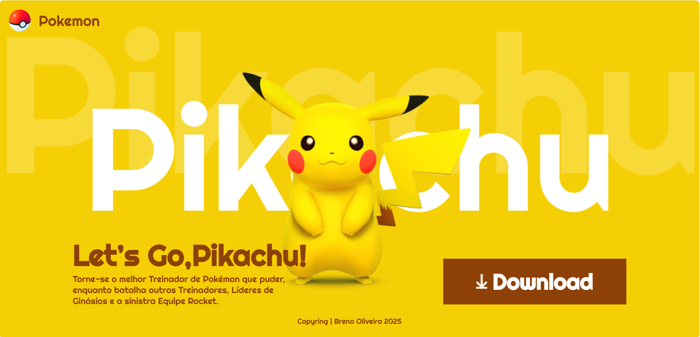

# Landing Page - Lest'go Pikachu
## Sobre
Projeto desenvolvido com o objetivo de testar a habilidade de criação de layouts responsivos para diferentes tamanhos de tela, como desktop, tablet e mobile.
O tema escolhido foi o Pikachu, baseado em um protótipo previamente criado pelo professor no Figma, servindo como base visual para a estruturação do layout.
## Desktop
- Largura: 1440px

## Tablet
- Largura: 770px

## Mobile
- largura: 375px

## Tecnologias
- HTML
- CSS
- Responsividade
## Autor
- [Breno](https://www.linkedin.com/in/breno-oliveira-assis-reis-203010351/)
